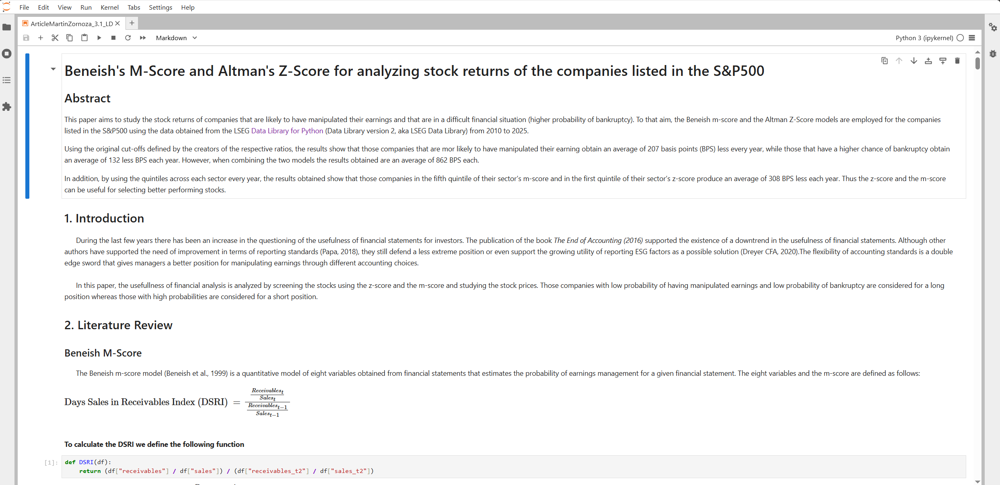

# Beneish's M-Score and Altman's Z-Score for analyzing stock returns of the companies listed in the S&P500

## Overview

This article was written by the winner of 2021 Q2 [Refinitiv Academic Competition](https://forms.gle/mnU6xWvpPNacHsi89). It is aimed at Academics from Undergraduate level up.

This article aims to study the stock returns of companies that are likely to have manipulated their earnings and that are in a difficult financial situation (higher probability of bankruptcy). To that aim, the [Beneish M-Score](https://www.investopedia.com/terms/b/beneishmodel.asp) and the [Altman Z-Score](https://www.investopedia.com/terms/a/altman.asp) models are employed for the companies listed in the S&P500 using the data obtained from LSEG [Data Library for Python](https://developers.lseg.com/en/api-catalog/lseg-data-platform/lseg-data-library-for-python) (Data Library version 2, aka LSEG Data Library) from 2010 to 2025.

Using the original cut-offs defined by the creators of the respective ratios, the results show that those companies that are more likely to have manipulated their earnings obtain an average of 207 basis points (BPS) less every year, while those that have a higher chance of bankruptcy obtain an average of 132 less BPS each year. However, when combining the two models the results obtained are an average of 862 BPS each.

In addition, by using the quintiles across each sector every year, the results obtained show that those companies in the fifth quintile of their sector’s m-score and in the first quintile of their sector’s z-score produce an average of 308 BPS less each year. Thus the z-score and the m-score can be useful for selecting better performing stocks.

## Prerequisite  

1. [LSEG Workspace Desktop application](https://www.lseg.com/en/data-analytics/products/workspace) with access to Data Library.
2. [Python](https://www.python.org/).
3. Access to internet for PyPI (or your local Python packages repository).

Please contact your LSEG Account Manager or Representative to help you get the Workspace account and services.

## <a id="rdp_lib"></a>Introduction to the Data Library for Python

The [Data Library for Python](https://developers.lseg.com/en/api-catalog/lseg-data-platform/lseg-data-library-for-python) provides a set of ease-of-use interfaces offering coders uniform access to the breadth and depth of financial data and services available on the Workspace, RDP, and Real-Time Platforms. The API is designed to provide consistent access through multiple access channels and target both Professional Developers and Financial Coders. Developers can choose to access content from the desktop, through their deployed streaming services, or directly to the cloud. With the Data Library, the same Python code can be used to retrieve data regardless of which access point you choose to connect to the platform.

 

The Data Library are available in the following programming languages:

- [Python](https://developers.lseg.com/en/api-catalog/lseg-data-platform/lseg-data-library-for-python)
- [.NET](https://developers.lseg.com/en/api-catalog/lseg-data-platform/lseg-data-library-for-net)
- [TypeScript](https://developers.lseg.com/en/api-catalog/lseg-data-platform/lseg-data-library-for-typescript)

For more deep detail regarding the Data Library for Python, please refer to the following articles and tutorials:

- [Quickstart](https://developers.lseg.com/en/api-catalog/lseg-data-platform/lseg-data-library-for-python/quick-start).
- [Documentation](https://developers.lseg.com/en/api-catalog/lseg-data-platform/lseg-data-library-for-python/documentation).
- [Tutorials](https://developers.lseg.com/en/api-catalog/lseg-data-platform/lseg-data-library-for-python/tutorials).
- [GitHub](https://github.com/LSEG-API-Samples/Example.DataLibrary.Python).

### Disclaimer

This project is based on Data Library Python versions **2.1.1**.

### Running the Notebook example.

1. Open a Command Prompt and go to project's folder
2. Run the following command in a Command Prompt to create a Python virtual environment named *venv* for the project.

    ```bash
    $>python -m venv venv
    ```

3. Once the environment is created, activate a virtual environment named ```venv``` with this command in a Command Prompt

    ```bash
    $>venv\Scripts\activate
    ```

    Or

    ```bash
    $>source ./venv/bin/activate
    ```

4. Go to project's notebook folder and update a content in ```lseg-data.config.json``` file with the your App-Key

    ```json
    {
        "logs": {
            "level": "debug",
            "transports": {
                "console": {
                    "enabled": false
                },
                "file": {
                    "enabled": false,
                    "name": "lseg-data-lib.log"
                }
            }
        },
        "sessions": {
            "default": "desktop.workspace",
            "desktop": {
                "workspace": {
                    "app-key": "YOUR APP KEY GOES HERE!"
                }
            }
        }
    }
    ```

5. Run the following command in a Command Prompt to install the project dependencies

    ```bash
    $>(venv) pip install -r requirements.txt
    ```

6. In the current Command Prompt, go to project's notebook folder. Run the following command to start Jupyter Lab in the notebook folder.

    ```bash
    $>(venv)>jupyter lab
    ```
7. Open *ArticleMartinZornoza_3.1_LD.ipynb* Notebook file, then follow through each notebook cell.

    

**Note**: If you are using AnaConda/MiniConda, please refer to this [Conda - Managing environments document](https://docs.conda.io/projects/conda/en/stable/user-guide/tasks/manage-environments.html) for more detail about how create and activate environment with Conda.

## <a id="references"></a>References

You can find more detail regarding the Data Library and related technologies for this Notebook from the following resources:

- [LSEG Data Library for Python](https://developers.lseg.com/en/api-catalog/lseg-data-platform/lseg-data-library-for-python) on the [LSEG Developer Community](https://developers.lseg.com/)
- [Data Library for Python - Reference Guide](https://developers.lseg.com/en/api-catalog/lseg-data-platform/lseg-data-library-for-python/documentation#reference-guide)
- [The Data Library for Python  - Quick Reference Guide (Access layer)](https://developers.lseg.com/en/article-catalog/article/the-data-library-for-python-quick-reference-guide-access-layer) article.
- [Essential Guide to the Data Libraries - Generations of Python library (EDAPI, RDP, RD, LD)](https://developers.lseg.com/en/article-catalog/article/essential-guide-to-the-data-libraries) article.
- [Upgrade from using Eikon Data API to the Data library](https://developers.lseg.com/en/article-catalog/article/Upgrade-from-using-Eikon-Data-API-to-the-Data-library) article.
- [Data Library for Python Examples on GitHub](https://github.com/LSEG-API-Samples/Example.DataLibrary.Python) repository.

For any question related to this example or Data Library, please use the Developers Community [Q&A Forum](https://community.developers.refinitiv.com).
